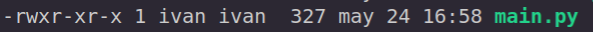
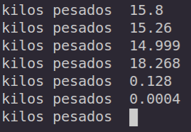
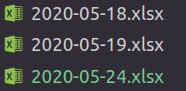
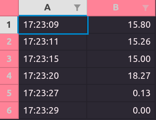

# Data Frames to Excel files

Python library: [*openpyxl*](https://openpyxl.readthedocs.io/en/stable/index.html)

## fileMamage Python Module

Este modulo sirve para la gestion del archivo. El archivo se crea en la misma carpta conde se encuetra este modulo. El nombre del archivo es el de la fecha en la que se corre el modulo.  

> **NOTA**:
>
> Este modulo crea el archivo al final de la rutina.
> Si el archivo existe y tiene el mismo nombre, este
> se sobre escribe.

## Instalación de dependencias

Abre una terminal con:

`ctrl` + `alt` + `t`

ingresa el siguiente comando en terminal:

``` bash
pip3 install openpyxl
```

> **NOTA**:  Si no tienes instalado pip3 en terminal ingresa:
>
> ``` bash
> sudo apt-get install python3-pip
>```

## Ejecutando Demo

### 1.- Ir al directorio del Demo

Una vez instalada la librería en terminal iremos a la carpeta Control_Vascula de este repositorio ejecutando en terminal:

``` bash
cd ruta_del_repositorio/control/Control_Vascula
```

Dentro de esta carpeta encontraremos los sigueintes archivos:

 * [fileManage.py]()
 * [main.py]()

### 2.- Corroborar permisos de ejecución

Antes de ejecutar el demo, nos aseguramos de que el archivo **main.py** tenga los permisos adecuados ejecutando en terminal el comando:

```bash
ls -la
```

Se desplegará una lista con los archivos en la carpeta. si el archivo **main.py** tiene los permisos como se muestra en la siguiente imagen. prosegimos al punto 3: la ejecución del demo.



>Si no tiene los permisos de ejecución
>en terminal ejecutamos:
>
>```bash
> sudo chmod u+x main.py
>```

### 3.- Ejecución del Demo

En terminal ejecutamos el demo con el siguiente comando:

```bash
./main
```

### 4.- Demo Input

En terminal nos aparecerá la siguente linea:


Esto significa que nuestro Demo *ya se esta corriendo*. Para realizar una entrada al demo debemos realizar lo siguente:

1. Ingresar un numero: `15.85`
1. Teclear `enter` para registrar el numero

en la siugente imagen se listan algunos ejemplos de entrada:



### 5.- Fin y creación del Archivo EXCEL

Para terminar el programa ingresamos un `0` y presionamos la tecla `enter`. En terminal aparecerá la leyenda:

>File created 

En nuestro directorio aparecerá una el archivo excel con la fecha en la que el demos fue ejecutado, en la siguiente imagen se muestran ejemplos del nombre:



### Contenido del Archvo

El archivo creado contendrá dos columnas:

* Hora de entrada del dato
* Dato

Si abrimos el archivo veremos nuestro demo de la siguiente forma:


